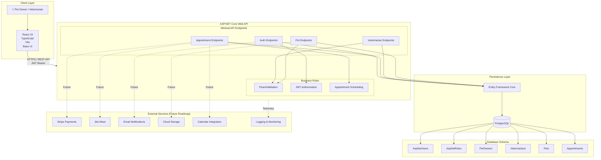

<div align="center">

# 🐾 PawCare

### Full-Stack Veterinary Appointment Management Platform

**ASP.NET Core &nbsp;•&nbsp; React &nbsp;•&nbsp; TypeScript**

[](https://dotnet.microsoft.com/)
[](https://react.dev/)
[](https://www.typescriptlang.org/)
[](https://www.postgresql.org/)
[](LICENSE)
[]()
[]()

<br/>

> PawCare is a full-stack web application that enables pet owners to register, manage their pets,  
> and book appointments with veterinarians through a clean and responsive interface.

<br/>

[Live Demo](https://paw-care-vet.vercel.app) &nbsp;•&nbsp; [API](https://pawcare-ecf0.onrender.com) &nbsp;•&nbsp; [Report Bug](#) &nbsp;•&nbsp; [Request Feature](#)


## Demo Environment Notice

This application is hosted using free-tier cloud services (Render, Vercel, and Neon). As a result, the backend service may enter a sleep state after periods of inactivity.

The first request after inactivity may take approximately 30–60 seconds while the API wakes up. Subsequent requests should respond normally.

This behavior is related to hosting limitations and does not reflect the application's production performance characteristics.


</div>

---

## 📋 Table of Contents

- [Features](#-features)
- [Demo](#-demo)
- [Screenshots](#-screenshots)
- [Architecture](#-architecture)
- [Tech Stack](#-tech-stack)
- [Getting Started](#-getting-started)
- [Configuration](#-configuration)
- [Demo Credentials](#-demo-credentials)
- [Project Structure](#-project-structure)
- [MVP Workflow](#-mvp-workflow)
- [Roadmap](#-roadmap)
- [Contributing](#-contributing)
- [License](#-license)
- [Author](#-author)

---

## ✨ Features

| | |
|---|---|
| 🐶 **Pet Management** — Manage multiple pets with full CRUD operations. | 📅 **Appointment Booking** — Schedule appointments with veterinarians. |
| 🔒 **JWT Authentication** — Secure authentication and role-based authorization. | 👩‍⚕️ **Veterinarian Directory** — Browse available veterinarians by specialty. |
| 📋 **Appointment Tracking** — View and manage upcoming appointments. | 📱 Responsive Design — Optimized for desktop and mobile devices. |

---

## 🎥 Demo

<!-- walkthrough -->
<video src="https://github.com/user-attachments/assets/d22687e8-7a50-4269-9bfe-6fb87846644d" width="1280" height="720" controls></video>
---

## 📸 Screenshots

<table>
  <tr>
    <th colspan="6" align="center"><b>Home</b></th>
  </tr>
  <tr>
    <td colspan="6" align="center">
      
    </td>
  </tr>

  <tr>
    <th colspan="3" align="center"><b>Register</b></th>
    <th colspan="3" align="center"><b>Login</b></th>
  </tr>
  <tr>
    <td colspan="3">
      
    </td>
    <td colspan="3">
      
    </td>
  </tr>

  <tr>
    <th colspan="2" align="center"><b>Dashboard</b></th>
    <th colspan="2" align="center"><b>My Appointments</b></th>
    <th colspan="2" align="center"><b>Veterinarian Directory</b></th>
  </tr>
  <tr>
    <td colspan="2">
      
    </td>
    <td colspan="2">
      
    </td>
    <td colspan="2">
      
    </td>
  </tr>

  <tr>
    <th colspan="2" align="center"><b>My Pets</b></th>
    <th colspan="2" align="center"><b>Add Pet</b></th>
    <th colspan="2" align="center"><b>Edit Pet</b></th>
  </tr>
  <tr>
    <td colspan="2">
      
    </td>
    <td colspan="2">
      
    </td>
    <td colspan="2">
      
    </td>
  </tr>
</table>

---

## 🏗 Architecture



---

## 🛠 Tech Stack

### Frontend

| Technology | Purpose |
|---|---|
| React 19 | UI framework |
| TypeScript | Type safety |
| Vite | Build tool & dev server |
| React Router | Client-side routing |
| TanStack Query | Server state & caching |
| React Hook Form + Zod | Form management & validation |
| Tailwind CSS v4 | Utility-first styling |
| shadcn/ui | Component library |
| Axios | HTTP client with JWT interceptor |
| Sonner | Toast notifications |

### Backend

| Technology | Purpose |
|---|---|
| ASP.NET Core (.NET 10) | Web API (Minimal APIs) |
| ASP.NET Core Identity | User management & password hashing |
| Entity Framework Core | ORM |
| Npgsql | PostgreSQL driver |
| JWT Bearer Auth | Stateless authentication |
| FluentValidation | Request input validation |
| Docker | Containerization |
| OpenAPI / Swagger | API documentation |

### Development Tools

- Visual Studio 2022
- Visual Studio Code
- Git & GitHub

---

## 🚀 Getting Started

### Prerequisites

- [.NET SDK 10](https://dotnet.microsoft.com/download)
- [Node.js 22+](https://nodejs.org/)
- [PostgreSQL 16+](https://www.postgresql.org/download/)
- Git

---

### Clone the repository

```bash
git clone https://github.com/asad-au-ullah-portfolio/PawCare.git
cd PawCare
```

---

### Backend

```bash
cd backend

dotnet restore

dotnet ef database update

dotnet run
```

API will be available at:

```
https://localhost:7228
```

---

### Frontend

```bash
cd frontend

npm install

npm run dev
```

Application will be available at:

```
http://localhost:5173
```

---

## ⚙ Configuration

Update `appsettings.json` with your values:

```json
{
  "ConnectionStrings": {
    "DefaultConnection": "Host=localhost;Database=PawCareDb;Username=your_user;Password=your_password"
  },
  "Jwt": {
    "Key": "YOUR_SECRET_KEY",
    "Issuer": "PawCareApi",
    "Audience": "PawCareClient",
    "ExpiryMinutes": 60
  }
}
```

---

## 🌍 Deployment

| Layer | Platform |
|---|---|
| Frontend | [Vercel](https://vercel.com/) |
| Backend | [Render](https://render.com/) |
| Database | [Neon PostgreSQL](https://neon.tech/) |

**Live URLs**

| | URL |
|---|---|
| Frontend | https://paw-care-coral.vercel.app |
| Backend API | https://pawcare-ecf0.onrender.com |

---

## 💡 Engineering Highlights

- Stateless JWT authentication with role-based authorization
- Ownership-scoped data access (pet owners see only their own data)
- Feature-folder backend architecture for clarity and maintainability
- Typed API client with Axios JWT interceptor and automatic token handling
- Server state management with TanStack Query (caching, invalidation, loading states)
- Form validation with React Hook Form + Zod schema definitions
- Responsive UI built with Tailwind CSS v4 and shadcn/ui
- PostgreSQL relational schema with EF Core migrations
- Cloud deployment with Vercel (frontend) and Render (backend)

---

## 📂 Project Structure

```
PawCare/
│
├── PawCare.Server/
│   ├── Features/
│   │   ├── Auth/            # Register, Login endpoints & DTOs
│   │   ├── Pets/            # Pet CRUD endpoints & DTOs
│   │   ├── Appointments/    # Booking & appointment history
│   │   └── Veterinarians/   # Veterinarian listing
│   ├── Entities/            # Domain entities (Pet, Appointment, etc.)
│   ├── Persistence/         # DbContext, seeders, EF configuration
│   ├── Infrastructure/      # Cross-cutting concerns
│   ├── Validators/          # FluentValidation validators
│   └── Migrations/
│
├── PawCare.Client/
│   ├── src/
│   │   ├── components/      # Shared UI components
│   │   ├── pages/           # Route-level page components
│   │   ├── hooks/           # Custom React hooks
│   │   ├── services/        # Axios API client & typed service calls
│   │   └── lib/             # Utilities, constants, Zod schemas
│   └── public/
│
└── README.md
```

---

## 📌 MVP Workflow

The current MVP supports the complete end-to-end user journey:

```
Register
    ↓
Login
    ↓
Dashboard
    ↓
Add Pet
    ↓
Browse Veterinarians
    ↓
Book Appointment
    ↓
View My Appointments
```

---

## 🛣 Roadmap

### v1.1 — Infrastructure
- [x] Docker & Docker Compose
- [x] Cloud deployment (Vercel + Render)
- [ ] CI/CD with GitHub Actions
- [ ] Structured logging (Serilog + Seq)

### v1.2 — Quality
- [ ] Integration tests
- [ ] OpenTelemetry + Grafana
- [ ] Health checks & response caching
- [ ] API rate limiting
- [ ] API documentation (Swagger)

### v2.0 — Features
- [ ] Email notifications & appointment reminders
- [ ] Online payments (Stripe)
- [ ] Real-time video consultations (Jitsi)
- [ ] Medical records & e-prescriptions
- [ ] Reviews & ratings
- [ ] Admin dashboard

---

## 🤝 Contributing

Contributions, suggestions, and feedback are welcome.

1. Fork the repository
2. Create a feature branch (`git checkout -b feature/your-feature`)
3. Commit your changes (`git commit -m 'Add your feature'`)
4. Push to the branch (`git push origin feature/your-feature`)
5. Open a Pull Request

---

## 📄 License

This project is licensed under the [MIT License](LICENSE).

---

## 👨‍💻 Author

**Asadullah Ehsan**

- LinkedIn: [Asadullah Ehsan](https://www.linkedin.com/in/asadullahehsan/)
- GitHub: [asad-au-ullah-portfolio](https://github.com/asad-au-ullah-portfolio)

---

<div align="center">

If you found this project useful, consider giving it a ⭐

</div>

## NestJS backend migration

A complete NestJS + Prisma migration of the ASP.NET Core API is available in `PawCare.Api/`. It preserves the existing REST routes and frontend response contract while replacing Minimal APIs, EF Core, ASP.NET Identity, and JWT plumbing with NestJS equivalents.

See `docs/migration-notes.md` for the architectural decisions and production-user migration note.
